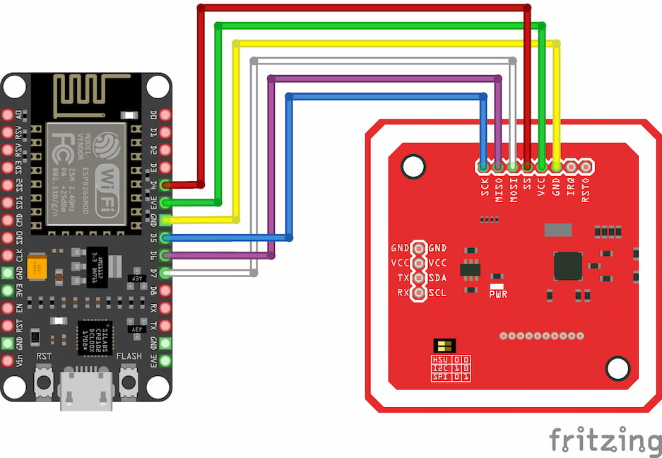

# IoT Record Player

Record player built with NodeMCU, ESP8266, PN532, and the Spotify Web API.

## Hardware

### Parts list

- [NodeMCU ESP8266 V3](https://inventr.io/products/nodemcu-esp8266-v3-lua-ch340-wifi-development-board)
- [PN532 NFC Module](https://www.amazon.ca/dp/B083DY9F9K?psc=1&ref=ppx_yo2ov_dt_b_product_details)
- [Mifare Classic 1K NFC Cards](https://www.amazon.ca/dp/B07S63VT7X?ref=ppx_yo2ov_dt_b_product_details&th=1)

### Schematics



#### Notes
- Make sure the PN532 module is in SPI mode, this can be configured through the switches on the board

## Software

### Setup development environment

- Download the ESP8266 module libraries following the instructions in the [esp8266/Arduino](https://github.com/esp8266/Arduino?tab=readme-ov-file#installing-with-boards-manager) repository
- Download the PN532 module libraries following the [elechouse/PN532](https://github.com/elechouse/PN532/tree/PN532_HSU?tab=readme-ov-file#getting-started) getting started guide
- In the Arduino board configuration, select the **NodeMCU 1.0 (ESP-12E Module)** board
- Select the correct serial port where the microcontroller is connected to

### Create Spotify application

- Create a Spotify application following the steps in the [Spotify developer documentation](https://developer.spotify.com/documentation/web-api/concepts/apps)
- Set the application's **Redirect URI** setting to `http://<YOUR_BOARD_IP_ADDRESS>/oauth/spotify`
  - This can be set after loading the program into the microcontroller and which connects it to the WiFi network and its IP address can be determined
- Take note of the application's **Client ID** and **Client Secret** values

### Define secrets

Copy `secrets.example.txt` into `secrets.cpp`, and set the values for these variables:

- `OAUTH_CLIENT_ID` and `OAUTH_CLIENT_SECRET`
  - The **Client ID** and **Client Secret** values of the Spotify application
- `OAUTH_REDIRECT_URL`
  - Set to `http://<YOUR_BOARD_IP_ADDRESS>/oauth/spotify` and should match the **Redirect URI** value of the Spotify application
- `WIFI_SSID` and `WIFI_PASSWORD`
  - The WiFi network's name and password
- `NFC_AUTHENTICATION_KEY` (Optional)
  - If you are using custom authentication keys for the NFC cards, set them here, otherwise these are set to a default value
- `CA_CERTIFICATE`
  - These is the root CA certificate to verify the OAuth endpoints' SSL certificate
  - To obtain these values for the Spotify APIs, run this command and copy the certificate in the output into this variable
    ```bash
    openssl s_client -connect accounts.spotify.com:443 -showcerts
    ```
    ```cpp
    // secrets.cpp
    String CA_CERTIFICATE = R"CERT(
    -----BEGIN CERTIFICATE-----
    <CERTIFICATE_BODY_HERE>
    -----END CERTIFICATE-----
    )CERT";
    ```

### Upload code to the microcontroller

- Connect the NodeMCU microcontroller to your computer
- Compile the code in `iot-record-player.ino` and upload it to the microcontroller

### Usage instructions

- Once the code has been uploaded and running in the microcontroller, visit `http://<YOUR_BOARD_IP_ADDRESS>` on your browser
- This performs an OAuth flow with the Spotify application to get access tokens that can be used to send requests to the Spotify API
  - After completing the OAuth flow, it's now ready to scan NFC cards and play its corresponding album/playlist on Spotify

#### Storing data in the NFC cards

- This project supports only Mifare Classic 1K NFC cards (4 bytes UID)
- The NFC cards need to store the Spotify context URI of the album or playlist
  - Example: `spotify:album:1A3nVEWRJ8yvlPzawHI1pQ`
- The NFC cards should store data starting at block number 4 in its storage memory, this project will start reading data from block number 4 until it encounters a `0xff` byte
  - The `writeNfcData` function in [`nfc.cpp`](nfc.cpp) can be used to write data to the correct location in the NFC cards
